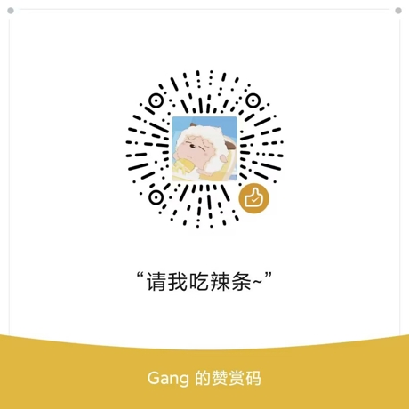

# Xpler

通用Xposed开发模板, 已经采用Kotlin重构，并且已经增加部分扩展方法。

项目替换了默认`ClassLoader`宿主App(multidex)可能导致部分方法无法找到的情况，默认对微信WebView进行Hook（模板代码）。

## 食用说明

- 1、将本项目`clone`至本地，直接`Run Install Apk`然后重启手机(`Lsposed`只需重启宿主应用即可)，运行微信然后随意打开一篇公众号文章，即可看到 `Hello Xpler!!`的Toast提示。
- 2、撰写自己的`Hook代码`：你只需要修改Xpler模板中的两处地方
  - 在`HookPackages -> packages`常量列表下增加宿主的包名。
  - 然后在`HookMain -> handleLoadPackage`方法下书写自己的`Hook逻辑代码`


## KtXposedHelpers.kt

对`XposedBridge`的进一步封装，简单示例：

```kotlin
KtXposedHelpers
            .hookClass(Test::class.java.name, lpparam.classLoader)
            .method("method1") {
                onReplace {
                    //method1 some hook logic..
                }
            }
	    .method("method2", String::class.java) {
            	onBefore {
            	    //method2 some hook logic..
            	}
                onAfter {
                    //method2 some hook logic..
                }
            }
```


可以同时对某个`Class`下的多个方法进行`Hook`。

- `onBefore`：目标方法执行之前调用，等价于`beforeHookedMethod`方法。
- `onAfter`：目标方法执行之后调用，等价于`afterHookedMethod`方法。
- `onReplace`：目标方法替换，等价于`replaceHookedMethod`方法（值得注意的是，当`onReplace`生效时，`onBefore`和`onAfter`将失效）。


## KtXposedMore.kt

对部分常用操作的扩展，简单示例：

```kotlin
/// Example1:
Test::class.java.hookMethod("method2", String::class.java) {
    onAfter {
        //method2 some hook logic..
    }
}

/// Example2
//需要确保该字符串是一个: 类名#方法名
"com.test.MainActivity#onCreate".hookMethod(lpparam.classLoader, Bundle::class.java) {
    onAfter {
        //onCreate some hook logic..
    }
}

/// Example3
// lpparam: XC_LoadPackage.LoadPackageParam
lpparam.hookClass(MainActivity::class)
    .hookMethod("onCreate", Bundle::class.java) {
        onAfter {
            //onCreate some hook logic..
        }
    }

/// Example4
// 加载模块中的布局文件
val moduleLayout = Context.inflateModuleView(R.layout.test)

... //剩下的自己探索吧
```


2023年3月11日，更新说明：

- 删掉了几个不太合理的扩展方法， 包括~~Context.showToast()~~，~~Context.xLog()~~ ，~~String.hookMethod()~~等，如更新使用请注意；

- ~~String.hookMethod()~~可以用上例中的`Example2`代替，或者使用新的扩展方法：`String.toClass().hookMethod()`

- 修改了`onBefore`、`onAfter`、`onReplace`三个方法的扩展模式，直接在`XC_MethodHook.MethodHookParam`进行扩展，简单来说就是：

  原来的写法：

  ```kotlin
  //...
  onAfter{
  	it.thisObject
  }
  //...
  ```

  现在的写法：

  ```kotlin
  //...
  onAfter{
  	thisObject
  }
  //...
  ```

  并且在现有的扩展的基础上增加了两个扩展属性：

  ```kotlin
  //...
  onAfter{
  	thisActivity // 如果`thisObject is Activity`否则将产生异常
      thisContext // 如果`thisObject is Context`否则将产生异常
  }
  //...
  ```


其他使用，Xpler中各方法使用注释已经补齐，开发中可自行阅读方法注释；

将Xpler模块化，可以参考：[FreedomPlus](https://github.com/GangJust/FreedomPlus)


----


<div align="center">
    <h2>赞赏</h2>
</div>

<div align="center">
    
</div>
